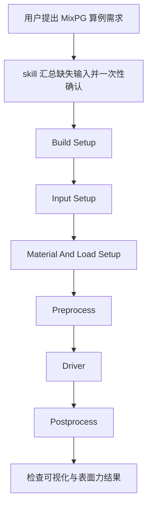

# MixPG Case Runner

`mixpg-case-runner` 是一个面向 Codex/skill 工作流的 MixPG 使用指南。
它的目标不是替代求解器本身，而是帮助用户更稳定地完成：

- 准备 `MixPERIGEE` / `MixPG` 示例算例
- 配置 build、输入文件、材料模型和加载
- 串行执行 preprocess、driver、postprocess
- 在运行前做保守的一致性检查

## 它能做什么

- 检查 `~/MixPERIGEE`、example 目录和 `~/build_MixPG`
- 指导修改：
  - `paras_preprocessor.yml`
  - `paras_preprocessor_init.yml`
  - `paras_driver.yml`
  - `LoadData.hpp`
  - 相关 postprocess 输入
- 根据加载类型选择：
  - `preprocess3d`
  - `preprocess3d_init`
  - `mixed_ga_driver`
  - `mixed_ga_driver_displacement`
- 按依赖顺序处理：
  - `reanalysis_proj_driver`
  - `prepostproc`
  - `post_surface_force`
  - `vis_3d_mixed`

## 下载

如果你只是想拿到这份 skill 源码：

```bash
git clone <your-repo-url> /path/to/CodeX-SKILL-MixPG
cd /path/to/CodeX-SKILL-MixPG
```

如果你已经在本机有这份仓库，就不需要重复下载。

## 安装

Codex 本地 skill 目录通常在：

```bash
~/.codex/skills/
```

安装 `mixpg-case-runner` 的最直接方式是把 skill 目录复制进去：

```bash
mkdir -p ~/.codex/skills/mixpg-case-runner
cp /path/to/CodeX-SKILL-MixPG/SKILL.md ~/.codex/skills/mixpg-case-runner/SKILL.md
```

如果你希望把仓库里的其它说明文件也一起保留，可以整个目录复制：

```bash
cp -R /path/to/CodeX-SKILL-MixPG ~/.codex/skills/mixpg-case-runner
```

本仓库作者当前本机使用的位置是：

- skill 源仓库：`/Users/chongran/CodeX-SKILL-MixPG`
- 本地安装版：`/Users/chongran/.codex/skills/mixpg-case-runner/SKILL.md`

## 怎么调用

在对话里显式提到 skill 即可触发，例如：

```text
[$mixpg-case-runner](~/.codex/skills/mixpg-case-runner/SKILL.md) 跑一个 traction 的例子
```

或者更直接：

```text
用 mixpg-case-runner 跑一个上表面沿 X 方向做 sin 剪切的例子
```

只要请求内容明显是在做 MixPG / MixPERIGEE 算例准备、运行或后处理，这个 skill 就应该被使用。

## 它会怎么和你对话

这个 skill 的默认交互方式是：

1. 先识别当前用户请求对应的算例类型
2. 把缺失的关键输入一次性汇总成一个问题
3. 用表格展示：
   - 可选项
   - 默认值
   - 单位或说明
4. 再开始 build / 输入修改 / preprocess / driver / postprocess

带单位的量默认按国际标准单位制 SI 解释。

对于 “保持当前” 这类选项，它应该尽量展开成具体值，例如：

- 当前 mesh：`4 x 4 x 4`
- 当前 constitutive model：具体模型类名
- 当前几何大小：例如 `0.1 x 0.1 x 0.1 m`

## 推荐对话方式

### 1. 直接说目标

```text
[$mixpg-case-runner](~/.codex/skills/mixpg-case-runner/SKILL.md)
跑一个 traction 的例子，我想看明显变形。
```

### 2. 给部分条件，剩下让 skill 帮你确认

```text
[$mixpg-case-runner](~/.codex/skills/mixpg-case-runner/SKILL.md)
跑一个上表面沿着 X 方向做 sin 剪切的例子，后处理要看到对应 traction。
```

### 3. 明确给全参数

```text
[$mixpg-case-runner](~/.codex/skills/mixpg-case-runner/SKILL.md)
跑一个 displacement shear case：
direction=x,
face=top,
u_x(t)=1.0e-2*sin(2*pi*t),
cpu_size=2,
final_time=1.0,
post_surface_force=allow,
vis_3d_mixed=allow
```

## 运行流程图



## 常见输入项

skill 常见会确认这些信息：

| 项目 | 例子 |
| --- | --- |
| loading mode | `traction` / `displacement` |
| load direction | `x` / `y` / `z` |
| loaded face | `top` / `bot` |
| traction expression | `Vector_3(0.0, 0.0, 1.0e6)` |
| displacement expression | `u_x(t)=1.0e-2*sin(2*pi*t)` |
| mesh | `4 x 4 x 4` |
| cpu_size | `6` |
| initial_time | `0.0` |
| initial_step | `0.01` |
| final_time | `1.0` |
| constitutive model | 当前代码里的具体模型名 |

## 后处理默认值

默认会把后处理程序分别列出来确认：

| 程序 | 默认 |
| --- | --- |
| `reanalysis_proj_driver` | allow |
| `prepostproc` | allow |
| `post_surface_force` | allow |
| `vis_3d_mixed` | allow |
| `divV_calculator` | skip |

如果启用了 `post_surface_force` 或 `vis_3d_mixed`，skill 应该同步处理：

- 对应输入文件
- 时间步范围
- 材料模型一致性
- 内变量个数一致性

## 重要规则

- 默认 build 目录策略现在是：`clean`
  默认删除原有 `~/build_MixPG` 再重建
- 不允许在科学算例使用的源文件仓库内直接创建 git commit
- 在执行过程中，不应折叠 terminal 命令或输出
- 如果 `geo_file_base`、`cpu_size`、`time_end` 或 postprocess 依赖不一致，应明确失败而不是猜测继续

## 相关文件

- skill 主文件：[SKILL.md](/Users/chongran/CodeX-SKILL-MixPG/SKILL.md)
- workflow 文档：[docs/automation-skeleton.md](/Users/chongran/CodeX-SKILL-MixPG/docs/automation-skeleton.md)
- build 准备脚本：[scripts/prepare_visco_build.sh](/Users/chongran/CodeX-SKILL-MixPG/scripts/prepare_visco_build.sh)
- executor 脚本：[scripts/mixpg_executor.sh](/Users/chongran/CodeX-SKILL-MixPG/scripts/mixpg_executor.sh)

## 一句话用法

如果你只想记住一条：

```text
[$mixpg-case-runner](~/.codex/skills/mixpg-case-runner/SKILL.md) + 你的算例目标
```

然后 skill 会把缺失输入整理成一个表格来和你确认，再开始跑流程。
