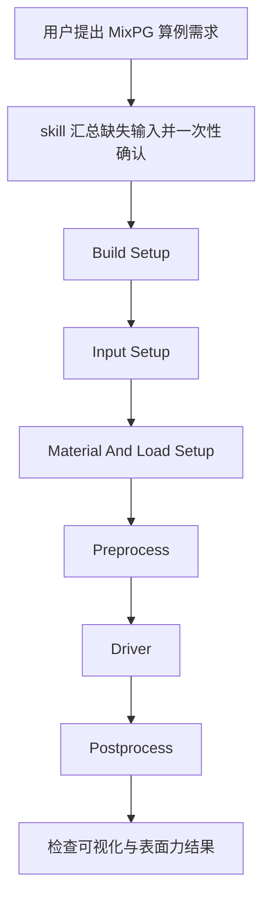

# MixPG Case Runner

`mixpg-case-runner` 是一个面向 Codex/skill 工作流的 MixPG 使用指南。
它的目标不是替代求解器本身，而是帮助用户更稳定地完成：

- 准备 `MixPERIGEE` / `MixPG` 示例算例
- 配置 build、输入文件、材料模型和加载
- 串行执行 preprocess、driver、postprocess
- 在运行前做保守的一致性检查

## 它能做什么

- 检查 `~/MixPERIGEE`、example 目录和 `~/build_MixPG`
- 指导修改：
  - `paras_preprocessor.yml`
  - `paras_preprocessor_init.yml`
  - `paras_driver.yml`
  - `LoadData.hpp`
  - 相关 postprocess 输入
- 根据加载类型选择：
  - `preprocess3d`
  - `preprocess3d_init`
  - `mixed_ga_driver`
  - `mixed_ga_driver_displacement`
- 按依赖顺序处理：
  - `reanalysis_proj_driver`
  - `prepostproc`
  - `post_surface_force`
  - `vis_3d_mixed`

## 下载

如果你只是想拿到这份 skill 源码：

```bash
git clone <your-repo-url> /path/to/CodeX-SKILL-MixPG
cd /path/to/CodeX-SKILL-MixPG
```

如果你已经在本机有这份仓库，就不需要重复下载。

## 安装

Codex 本地 skill 目录通常在：

```bash
~/.codex/skills/
```

安装 `mixpg-case-runner` 的最直接方式是把 skill 目录复制进去：

```bash
mkdir -p ~/.codex/skills/mixpg-case-runner
cp /path/to/CodeX-SKILL-MixPG/SKILL.md ~/.codex/skills/mixpg-case-runner/SKILL.md
```

如果你希望把仓库里的其它说明文件也一起保留，可以整个目录复制：

```bash
cp -R /path/to/CodeX-SKILL-MixPG ~/.codex/skills/mixpg-case-runner
```

本仓库作者当前本机使用的位置是：

- skill 源仓库：`/Users/chongran/CodeX-SKILL-MixPG`
- 本地安装版：`/Users/chongran/.codex/skills/mixpg-case-runner/SKILL.md`
- 兼容根目录入口：`/Users/chongran/.codex/skills/SKILL.md`

如果你既会用根目录入口，也会用具名目录入口，最好两边都保持同步，避免不同触发方式命中不同版本。

## 怎么调用

在对话里显式提到 skill 即可触发，例如：

```text
[$mixpg-case-runner](~/.codex/skills/mixpg-case-runner/SKILL.md) 跑一个 traction 的例子
```

或者更直接：

```text
用 mixpg-case-runner 跑一个上表面沿 X 方向做 sin 剪切的例子
```

只要请求内容明显是在做 MixPG / MixPERIGEE 算例准备、运行或后处理，这个 skill 就应该被使用。

如果你明确要做分支对比，也可以直接这样说：

```text
用 mixpg-case-runner 比较 master 和某个开发分支
```

或者：

```text
比较两个分支在 viscoelasticity example 上的运行结果并生成报告
```

这个“分支对比 mode”只有在用户明确要求比较 branch 时才会启用；普通跑算例不会自动进入这个 mode。

## 它会怎么和你对话

这个 skill 的默认交互方式是：

1. 先识别当前用户请求对应的算例类型
2. 把缺失的关键输入一次性汇总成一个问题
3. 用表格展示：
   - 可选项
   - 默认值
   - 单位或说明
4. 再开始 build / 输入修改 / preprocess / driver / postprocess

带单位的量默认按国际标准单位制 SI 解释。

对于 “保持当前” 这类选项，它应该尽量展开成具体值，例如：

- 当前 mesh：`4 x 4 x 4`
- 当前 constitutive model：具体模型类名
- 当前几何大小：例如 `0.1 x 0.1 x 0.1 m`

## 推荐对话方式

### 1. 直接说目标

```text
[$mixpg-case-runner](~/.codex/skills/mixpg-case-runner/SKILL.md)
跑一个 traction 的例子，我想看明显变形。
```

### 2. 给部分条件，剩下让 skill 帮你确认

```text
[$mixpg-case-runner](~/.codex/skills/mixpg-case-runner/SKILL.md)
跑一个上表面沿着 X 方向做 sin 剪切的例子，后处理要看到对应 traction。
```

### 3. 明确给全参数

```text
[$mixpg-case-runner](~/.codex/skills/mixpg-case-runner/SKILL.md)
跑一个 displacement shear case：
direction=x,
face=top,
u_x(t)=1.0e-2*sin(2*pi*t),
cpu_size=2,
final_time=1.0,
post_surface_force=allow,
vis_3d_mixed=allow
```

### 4. 明确要求分支对比

```text
用 mixpg-case-runner 比较 master 和 feature/xxx，在同一个 viscoelasticity case 上跑完并出对比报告
```

## 分支对比 mode

这个 mode 用于比较两个 source branch 在同一个
`viscoelasticity_NURBS_TaylorHood` 算例上的行为差异。

它的默认原则是：

- 只有用户明确要求比较 branch 时才启用
- 两个 branch 必须跑完全相同的 case
- 两个 branch 必须使用隔离的 source workspace 和隔离的 build 目录
- 不允许一个 branch 复用另一个 branch 的 build 产物
- 比较完成后，每个 branch workspace 都必须恢复为无 diff 状态
- 如果单分支 workflow 依赖 machine-local 配置文件，例如 `conf/system_lib_loading.cmake` 这类 git worktree 不一定自带的文件，compare mode 需要显式把这些本地配置补到每个隔离 workspace，再开始 build

如果用户只说“比较开发分支和主分支”，skill 应先列出分支供用户确认，再开始执行。

分支对比报告至少应覆盖三层内容：

- workflow 对比：
  build / preprocess / driver / postprocess 是否成功
- artifact 对比：
  关键输出文件是否齐全，例如 `SOL_*`、`Force_disp_record.txt`
- result 对比：
  位移、力或 traction 的摘要指标和代表性曲线/图像

如果其中一个 branch 失败，报告应明确写出失败发生在哪个 stage，而不是假装两个 branch 都拿到了可比结果。

另外，compare mode 不能只看“两个 branch 都跑起来了”：

- 如果共享 case 实际上没有被正确激活，两个 branch 可能都会给出全零响应
- 这不应被当成“结果一致”
- 在进入正式对比报告前，skill 至少要检查一个简单响应量是否非零，例如位移、力或 traction 曲线

还有一条很重要：

- compare mode 不能只比文件名是否改了
- 它必须比“语义上是不是同一个 case”
- 比如位移加载方向，必须同时检查 runtime YAML、init YAML、driver 方向代码和加载函数是否在两个 branch 上都指向同一个方向

## 运行流程图



## 常见输入项

skill 常见会确认这些信息：

| 项目 | 例子 |
| --- | --- |
| loading mode | `traction` / `displacement` |
| load direction | `x` / `y` / `z` |
| loaded face | `top` / `bot` |
| traction expression | `Vector_3(0.0, 0.0, 1.0e6)` |
| displacement expression | `u_x(t)=1.0e-2*sin(2*pi*t)` |
| mesh | `4 x 4 x 4` |
| cpu_size | `6` |
| initial_time | `0.0` |
| initial_step | `0.01` |
| final_time | `1.0` |
| constitutive model | 当前代码里的具体模型名 |

## 后处理默认值

默认会把后处理程序分别列出来确认：

| 程序 | 默认 |
| --- | --- |
| `reanalysis_proj_driver` | allow |
| `prepostproc` | allow |
| `post_surface_force` | allow |
| `vis_3d_mixed` | allow |
| `divV_calculator` | skip |

如果启用了 `post_surface_force` 或 `vis_3d_mixed`，skill 应该同步处理：

- 对应输入文件
- 时间步范围
- 材料模型一致性
- 内变量个数一致性

位移加载还有一条默认规则：

- 尽量保持位移和速度都是光滑加载
- 默认避免任何突变、折点或不连续速度
- 如果没有特别说明，优先选用 `sin`、平滑 ramp 或其他速度连续的位移历程
- 如果目标是很大的拉伸，比如伸长比 `>= 1.5`，skill 会默认先尝试平滑加载，但不会假装保证当前默认时间步和材料参数一定稳定；如果 driver 发散，会明确停下，而不是偷偷改科学参数

## 当前版本的几个关键护栏

这个 skill 现在明确按当前 MixPG 版本的真实代码行为来工作，而不只看旧说明文档。

- `geo_file_base`：
  当前 `preprocess3d` / `preprocess3d_init` 会给 `geo_file_base` 自动加 `HOME` 前缀，所以像 `~/build_MixPG/patch` 这类 build 几何，YAML 里更安全的写法是 `/build_MixPG/patch`，而不是直接写 `/Users/<name>/build_MixPG/patch`
- 位移方向一致性：
  改位移加载方向时，不只要看 `LoadData.hpp` 和 `PNonlinear_Solver.cpp`，还要检查 `mixed_ga_driver_displacement.cpp` 里的初始速度基向量是不是同一个方向
- `reanalysis_proj_driver -vis_m`：
  当前源码默认 `vis_m = 1`，但如果材料模型有多个 Maxwell / internal-variable 分支，skill 必须显式传正确的 `-vis_m`，不能偷懒用默认值
- `paras_pos_vis.yml.time_end`：
  模板文件里的 `time_end` 可能只是很大的占位值，不能直接拿来跑；必须先和当前实际 `SOL_*` 输出范围对齐
- 旧运行说明：
  如果 `simulation_running_note.txt` 这类旧说明和当前可执行程序或真实命令顺序冲突，skill 会以当前源码和当前 build 出来的可执行程序为准

其中位移方向一致性现在应被当成运行前硬阻断条件，而不是运行中再发现的问题：

- 运行前要同时检查 runtime YAML
- 运行前要同时检查 init YAML
- 运行前要同时检查 `mixed_ga_driver_displacement.cpp`
- 运行前要同时检查 `PNonlinear_Solver.cpp`

只要这几处方向不一致，就不应该继续 build、preprocess 或 driver。

## 报告交付

运行和后处理完成后，skill 现在还应继续交付一份报告包，默认放在：

- `~/build_MixPG/report`

说明：

- 如果报告里的可视化图是从 `vis_3d_mixed` 输出文件再生成的图片，就应如实描述为生成的可视化图片
- 只有真的通过 ParaView 做了渲染或截图，才能把它称为 ParaView 预览图

这个 `report` 文件夹里至少应包含：

- `post_surface_force` 生成的数据对应的科研风格图片
- `vis_3d_mixed` 导出的代表性可视化图片
- 一份 Markdown 报告
- 一份由 Markdown 转换得到的 PDF 报告

报告不应该每次从零生成整篇正文。更推荐的做法是：

- 复用固定的 Markdown 报告模板
- 只替换本次 case 的参数、数值结果、图片路径和简短解释
- 把重复不变的章节骨架保留下来

这样更稳定，也更省 token。

如果本机环境已经具备 `matplotlib`、`meshio`、`pandoc` 和 `xelatex`，
更推荐直接复用仓库里的固定报告脚本：

```bash
python3 /Users/chongran/CodeX-SKILL-MixPG/scripts/render_mixpg_report.py ...
```

它的职责就是：

- 读取现成的 `Force_disp_record.txt` 和 `vis_3d_mixed` 结果
- 生成科研风格图片
- 用模板填充 Markdown 报告
- 导出 PDF

报告内容至少应覆盖：

- case 简述
- geometry / mesh
- constitutive model
- loading
- solver / time stepping
- 力或 traction 曲线图
- 可视化图
- 简短结果解释

对简单单向加载，力学图默认只画加载方向对应的位移和 traction / force，
不强制加入其他无关分量，这样图更适合科研展示。

## 重要规则

- 默认 build 目录策略现在是：`clean`
  默认删除原有 `~/build_MixPG` 再重建
- 不允许在科学算例使用的源文件仓库内直接创建 git commit
- 运行完成后，必须把 `MixPG` / `MixPERIGEE` 源仓库里的临时改动全部恢复掉，最终不允许留下任何 `git diff`
- 在执行过程中，不应折叠 terminal 命令或输出
- 如果 `geo_file_base`、`cpu_size`、`time_end` 或 postprocess 依赖不一致，应明确失败而不是猜测继续
- 如果 driver 已经出现非线性发散，即使产生了部分 `SOL_*` 文件，也不能把这次运行包装成“成功完成”并继续生成最终报告

## 相关文件

- skill 主文件：[SKILL.md](/Users/chongran/CodeX-SKILL-MixPG/SKILL.md)
- workflow 文档：[docs/automation-skeleton.md](/Users/chongran/CodeX-SKILL-MixPG/docs/automation-skeleton.md)
- build 准备脚本：[scripts/prepare_visco_build.sh](/Users/chongran/CodeX-SKILL-MixPG/scripts/prepare_visco_build.sh)
- executor 脚本：[scripts/mixpg_executor.sh](/Users/chongran/CodeX-SKILL-MixPG/scripts/mixpg_executor.sh)

## 一句话用法

如果你只想记住一条：

```text
[$mixpg-case-runner](~/.codex/skills/mixpg-case-runner/SKILL.md) + 你的算例目标
```

然后 skill 会把缺失输入整理成一个表格来和你确认，再开始跑流程。
